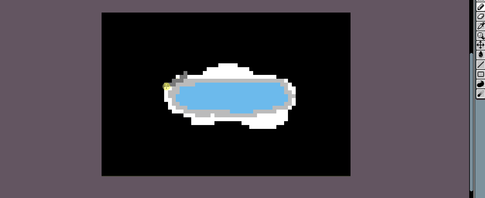
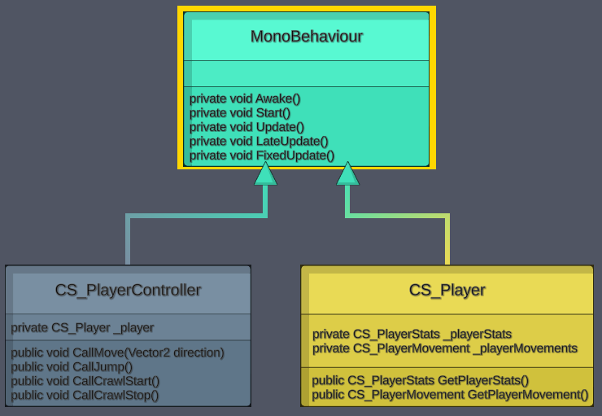
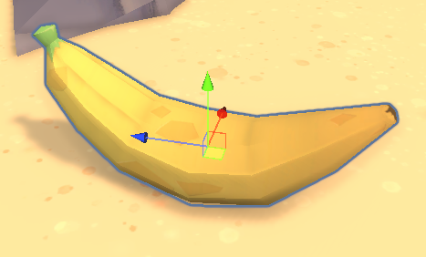
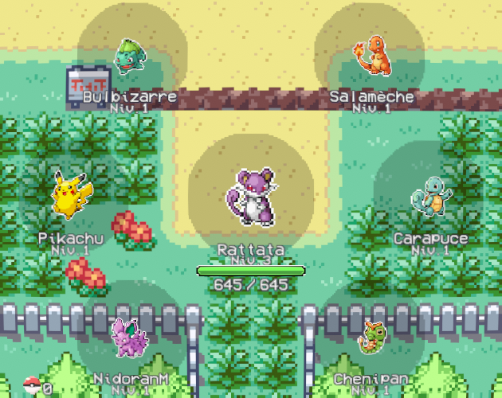
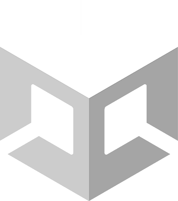
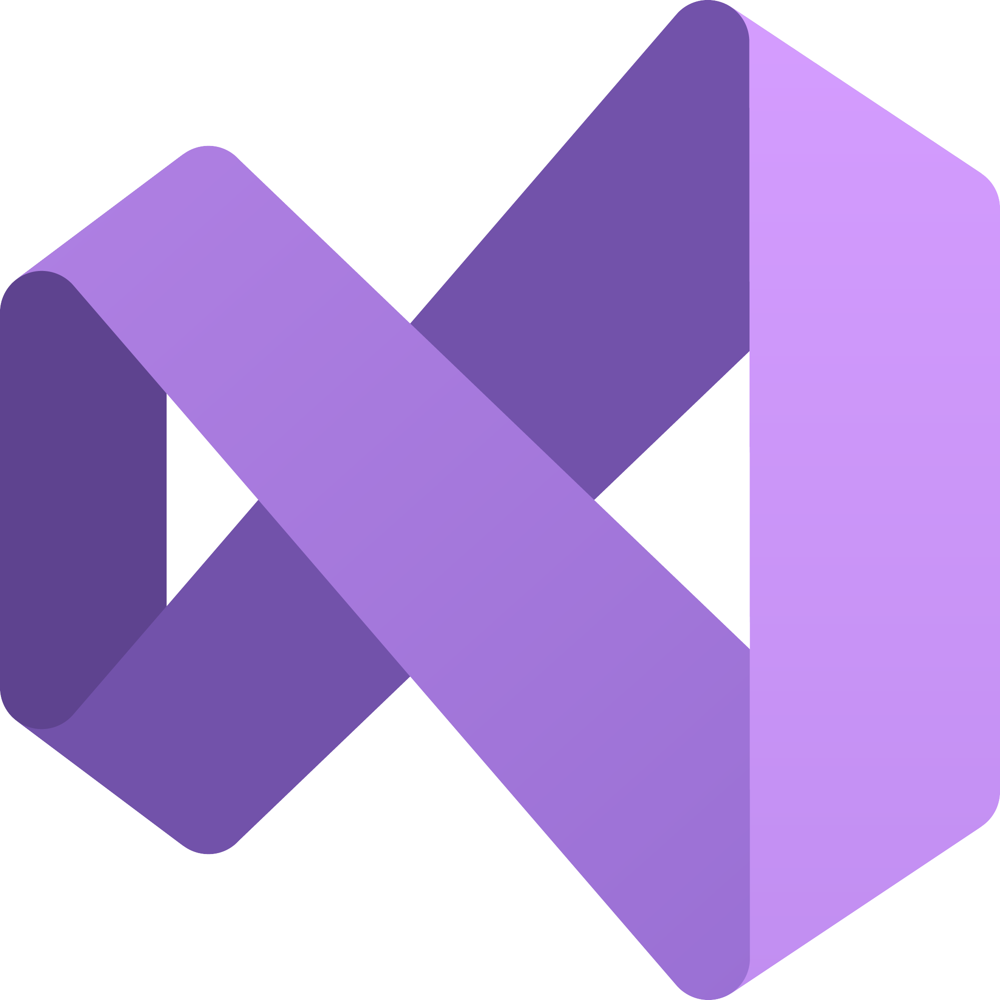
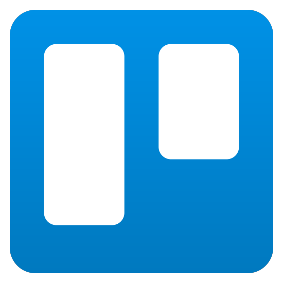

`[Portfolio en cours de création]`  
`[Dernière mise à jour : 04/07/2023 - 23:37 - UTC+2]`

---

You are seeing the French version of my Profile.  
Click [HERE](https://github.com/Ash2oPS/Ash2oPS/blob/main/README_EN.md) to go to the English Version! 

---

<h3 align="center"> Salut ! Je m'appelle </h3>
<h1 align="center"> 🍃 Etienne Sibeaux ! 🍂 </h1>

- [Qui suis-je ?](https://github.com/Ash2oPS#%EF%B8%8F-qui-suis-je-)
- [Mes Outils](https://github.com/Ash2oPS#wrench-mes-outils-projets-personnels-non-disponibles-publiquement)
- [Mes Jeux](https://github.com/Ash2oPS#video_game-mes-jeux)
- [Les logiciels que j'utilise](https://github.com/Ash2oPS#-les-logiciels-que-jutilise)
- [Mon CV](https://github.com/Ash2oPS#page_facing_up-mon-cv)
- [Où me contacter ?](https://github.com/Ash2oPS#telephone-o%C3%B9-me-contacter-)

## 🙆‍♂️ Qui suis-je ?

Je suis un `Programmeur de Jeux Vidéo et d'Outils` de 23 ans.  

Je viens d'obtenir mon bachelor en Conception et Réalisation de Jeux Vidéo et je serais ravi de travailler au sein d'une de vos 
équipes. :relieved:

J'ai commencé à m'intéresser au développement de Jeux Vidéo en 2015 avec RPG Maker VX Ace, mais je m'y suis pris de passion à partir
de 2016 quand j'ai commencé à utilise Game Maker Studio 2 !  
C'est alors qu'en 2020 j'intègre l'`ETPA` de `Rennes` après avoir obtenu mon BTS Systèmes Numériques Informatique et Réseaux. J'en 
sors avec mon bachelor en poche en juin 2023 ! Pendant ces 3 ans d'étude, j'ai eu l'occasion de travailler énormément avec Unity pour
des projets étudiants et d'autres personnels. C'est par conséquent avec ce moteur que je suis le plus à l'aise. Petit à petit, je me 
suis découvert une seconde passion pour le développement d'outils pour faciliter le travail de mes coéquipiers ! Rapidement, je me suis 
mis à beaucoup utiliser `UnityEditor` pour tous mes projets.

 

---

## :wrench: Mes Outils [Projets Personnels, non disponibles publiquement]

##  Éditeur de Maps 2D Isométriques 

Un outil simple d'utilisation et  bien pratique pour créer des maps 2D isométriques.

## Pour en apprendre d'avantage, rendez-vous [ICI](https://github.com/Ash2oPS/Ash2oPS/blob/main/TOOL_ISOMETRIC_MAP_GENERATOR_FR.md) !

 
 

## :clipboard: Générateur de diagrammes UML 📃

Un programme permettant de générer le diagramme UML d'un projet Unity.

## Pour en apprendre d'avantage, rendez-vous [ICI](https://github.com/Ash2oPS/Ash2oPS/blob/main/TOOL_UML_GRAPH_FR.md) !

 
 

## :banana: [Projet Étudiant] Éditeur d'Items :coconut:

Un Éditeur d'Items pour un projet étudiant qui permet à n'importe quel membre de l'équipe de créer des Items uniques sans écrire la
moindre ligne de code.

## Pour en apprendre d'avantage, rendez-vous [ICI](https://github.com/Ash2oPS/Ash2oPS/blob/main/TOOL_ITEM_EDITOR_FR.md) !

 

---

## :video_game: Mes jeux

`[Section en cours de création]`

Pour voir la plupart de mes jeux, rendez-vous [ICI](https://ash2o.itch.io/) !
 
Voici quelques autres projets.

## 🔥 [WIP] Idle Pokémon 🐲

Un projet personnel en cours de développement. 
Vous pouvez retrouver le lien vers un trailer [ICI](https://youtu.be/U815CxDImCI).

## Pour en apprendre d'avantage, rendez-vous [ICI](https://github.com/Ash2oPS/Ash2oPS/blob/main/GAME_POKEMON_IDLE_FR.md) !

---

## 🫳 Les logiciels que j'utilise

### :video_game: Développement de Jeux Vidéo et d'Outils :wrench:

 

&emsp;&emsp;&emsp;

 
 

### ✍️ 2D & 3D :house:

 

&emsp;

&emsp;

 
 

### 📈 Versioning 📉 

 

&emsp;&emsp;&emsp;

 
 

### 🗓 Gestion de Projets 📌

 

&emsp;&emsp;&emsp;

 

---

## :page_facing_up: Mon CV

Si vous êtes intéressé(e), vous pouvez retrouver mon CV [ICI](https://github.com/Ash2oPS/Ash2oPS/blob/main/PDF_Main_Resume_FR.pdf) :wink:  

---

## :telephone: Où me contacter ?

 

&emsp;
&emsp;&emsp;
&emsp;&emsp;
&emsp;

  

**`esibeaux.pro@outlook.fr`**

