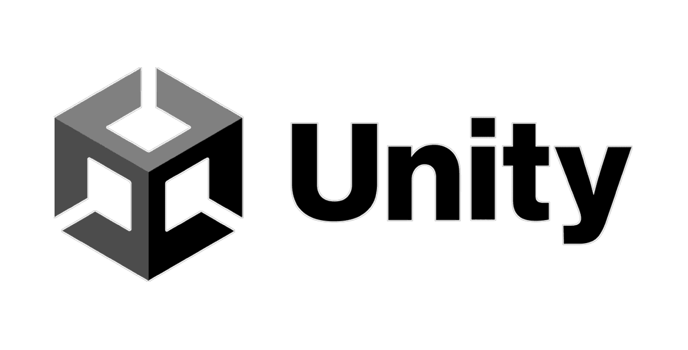
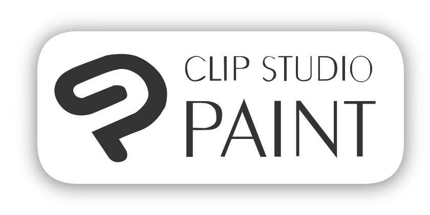

<h3 align="center"> Hello! I'm </h3>
<h1 align="center"> 🍃 Etienne Sibeaux! 🍂 </h1>

## Who am I?

I'm a 23 year-old **`Video Game Systems & Tools Programmer`**!  

I just obtained my degree in **Video Games Development** and I'd be happy to work in collaboration with you. :relieved:  

I started learning how to create **Video Games** in 2016 with **Game Maker Studio 2**, and it quickly became my strongest passion.  
Therefore I studied IT and Networking for 2 years before I went to **`ETPA Rennes`** (France) to really learn how to create **Games**. 
During these **3 years** of studies I used **`Unity`** a lot, whether for **student** or **personnal projects**, so it's with this 
**Engine** that I'm the most comfortable to work **with** and **on**. Using it allowed me to discovered a new center of interest that
I didn't even know about: **`Tooling`**! Quickly **UnityEditor** became one of my best partners for my projects.

## My Tools

## My Games

## What do I use?

## How to contact me?

&emsp;
&emsp;&emsp;
&emsp;&emsp;
&emsp;

  

**`esibeaux.pro@outlook.fr`**

