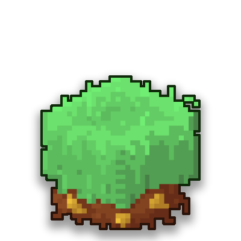

<h3 align="center"> Hello! I'm </h3>
<h1 align="center"> 🍃 Etienne Sibeaux! 🍂 </h1>

## 🙆‍♂️ Who am I?

I'm a 23 year-old **`Video Game Systems & Tools Programmer`**!  

I just obtained my degree in **Video Games Development** and I'd be happy to work in collaboration with you. :relieved:  

I started learning how to create **Video Games** in 2016 with **Game Maker Studio 2**, and it quickly became my strongest passion.  
Therefore I studied IT and Networking for 2 years before I went to **`ETPA Rennes`** (France) to really learn how to create **Games**. 
During these **3 years** of studies I used **`Unity`** a lot, whether for **student** or **personnal projects**, so it's with this 
**Engine** that I'm the most comfortable to work **with** and **on**. Using it allowed me to discovered a new center of interest that
I didn't even know about: **`Tooling`**! Quickly **UnityEditor** became one of my best partners for my projects.

## :wrench: My Tools [Personal Projects, not available for public usage]

<h3 align="center"> Isometric 2D Map Generator </h3>

In most cases, creating a map for a 2D isometric game can be pretty annoying. Once every block sprite is created, you open
your map editor program, you pick one block sprite, you draw your shape, one sprite at a time, you pick another sprite, you 
draw, but eh, the first shape doesn't fit... You got it, it can be pretty frutrating. And that's exactly why I started creating 
this tool. With this 2D Isometric Map Generator, creating maps for your 2D Iso game is way easier.  
Here's the trick:

As you can see, this tool allows you to create maps quickly and easily. It only takes a low-res texture as an input to create a procedural
isometric world. In this case used sprites to create it are made in pixel art (only because I like it) but of course, it can be used 
with other styles! Currently, changing the sprites to our need is absolutely possible and you can absolutely use several sprites with
one texture input.

Each pixel color 

## :video_game: My Games

## 🫳 What do I use?

        

 

[<h3 align="center"> :large_orange_diamond: Hacknplan :large_orange_diamond: </h3>](https://www.hacknplan.com) 

(Didn't find any good logo on Google Images)

## :telephone: How to contact me?

&emsp;
&emsp;&emsp;
&emsp;&emsp;
&emsp;

  

**`esibeaux.pro@outlook.fr`**

