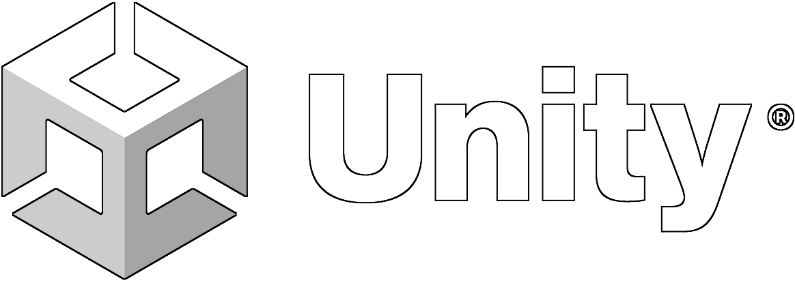
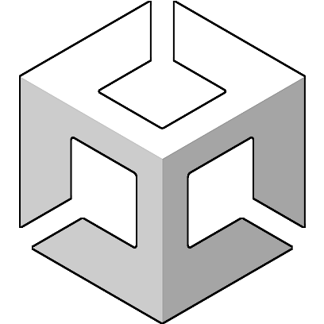

<h3 align="center"> Hello! I'm </h3>
<h1 align="center"> 🍃 Etienne Sibeaux! 🍂 </h1>

- [Who am I?](https://github.com/Ash2oPS#%EF%B8%8F-who-am-i)
- [My Tools](https://github.com/Ash2oPS#wrench-my-tools-personal-projects-not-available-for-public-usage)
- [My Games](https://github.com/Ash2oPS#video_game-my-games)
- [What do I use](https://github.com/Ash2oPS#-what-do-i-use)
- [How to contact me?](https://github.com/Ash2oPS#telephone-how-to-contact-me)

## 🙆‍♂️ Who am I?

I'm a French 23 year-old **`Video Game Systems & Tools Programmer`**!  

I just obtained my degree in **Video Games Development** and I'd be happy to work in collaboration with you. :relieved:  

I started learning how to create **Video Games** in 2016 with **Game Maker Studio 2**, and it quickly became my strongest passion.  
Therefore I studied IT and Networking for 2 years before I went to **`ETPA Rennes`** (France) to really learn how to create **Games**. 
During these **3 years** of studies I used **`Unity`** a lot, whether for **student** or **personnal projects**, so it's with this 
**Engine** that I'm the most comfortable to work **with** and **on**. Using it allowed me to discovered a new center of interest that
I didn't even know about: **`Tooling`**! Quickly **UnityEditor** became one of my best partners for my projects.

 

---

## :wrench: My Tools [Personal Projects, not available for public usage]

## :world_map: Isometric 2D Map Generator :triangular_ruler:

An easy-to-use and convenient tool to create procedural 2D Isometric Maps in Unity!

### [You want more informations? Click here!](https://github.com/Ash2oPS/Ash2oPS/blob/main/TOOL_ISOMETRIC_MAP_GENERATOR.md)

 

---

## :video_game: My Games

 

---

## 🫳 What do I use?

### :video_game: Video Games & Tools Development :wrench:

 

&emsp;&emsp;&emsp;

 
 

### ✍️ 2D & 3D Art :house:

 

&emsp;

&emsp;

 
 

### 📈 Versioning 📉 

 

&emsp;&emsp;&emsp;

 
 

### 🗓 Project Management 📌

 

&emsp;&emsp;&emsp;

 

---

## :telephone: How to contact me?

 

&emsp;
&emsp;&emsp;
&emsp;&emsp;
&emsp;

  

**`esibeaux.pro@outlook.fr`**

