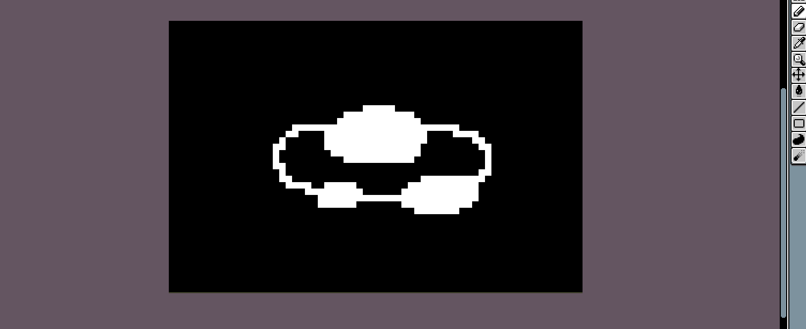

 

[⬅️ Back to Profile](https://github.com/Ash2oPS/Ash2oPS/blob/main/README_EN.md)

---

# :world_map: Isometric 2D Map Generator :triangular_ruler:

 

- [What is it?](https://github.com/Ash2oPS/Ash2oPS/blob/main/TOOL_ISOMETRIC_MAP_GENERATOR.md#what-is-it)
- [Block Parameters](https://github.com/Ash2oPS/Ash2oPS/blob/main/TOOL_ISOMETRIC_MAP_GENERATOR.md#block-parameters)
- [Map Skin](https://github.com/Ash2oPS/Ash2oPS/blob/main/TOOL_ISOMETRIC_MAP_GENERATOR.md#map-skin)
- [What's Next?](https://github.com/Ash2oPS/Ash2oPS/blob/main/TOOL_ISOMETRIC_MAP_GENERATOR.md#whats-next)

## What is it?

In most cases, creating a map for a 2D isometric game can be tedious. Once every block sprite is created, you open
your map editor program, you pick one block sprite, you draw your shape, one sprite at a time, you pick another sprite, you 
draw, but eh, the first shape doesn't fit... You got it, it can be pretty frustrating. And that's exactly why I started creating 
this tool. With this 2D Isometric Map Generator, creating maps for your 2D Iso game is way easier.  
Here's the trick:

 

 

As you can see, this tool allows you to create maps quickly and easily. It only takes a low-res texture as an input to create a procedural
isometric world. In this case used sprites to create it are made in pixel art (only because I like it) but of course, it can be used 
with other styles! Currently, changing the sprites to our need is absolutely possible and you can use several sprites with
one texture input.

 

 

## Block Parameters

Each pixel color corresponds to a block sprite that you can easily set up. Plus you can set several parameters to these block
in order to make them look unique. For example, liquids such as water or lava have a strong passive wavy animation. Whereas other
blocks have a more subtle animation. On the other hand, to make sand look more messy than the other blocks, its height is more 
randomly determined.

 

 

To use the whole power of this tool, a certain setup is adviced concerning the block sprites. When drawing the sprite, keep in mind
that you have to create two versions of it. It can sound counter productive, but it will allow you to generate an enormous number of
variations for this block. Create a greyscale version of the block that will represent the shadows applied to it and a Red-Green-Blue
version. This weird-lookin version is used to determine the different colors that will be applied to the sprite. This combination
is used by a shader in Unity to create procedural variations.

 

 

## Map Skin

In order to control all these **block parameters**, the map has some rules that are applied. This group of rules is called a Map Skin. 
With a Map Skin, you can set the global tint of the shadows, the block sprite corresponding to a certain texture pixel color, 
the possible colors for its Red-Green-Blue parts. I said "possible" because if you want this block to have slightly different 
colors than its neighbors, you can since you don't set up flat colors but gradients in order to pick a random color in it.

## What's next?

This tool is currently a **work in progress** and would need some fixes concerning the way it works. 
Let's take a minute to think about what we could do with it. If we plug it to a **random map generator** we could easily create some
`Pokemon Mystery Dungeon`-like **random maps** in a isometric style.

---

 

[⬅️ Back to Profile](https://github.com/Ash2oPS/Ash2oPS/blob/main/README_EN.md)

