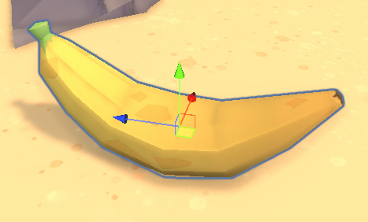

 

[⬅️ Retour au Profil](https://github.com/Ash2oPS)

---

# :banana: Éditeur d'Items :coconut:

 
 

- [Qu'est-ce donc ?](https://github.com/Ash2oPS/Ash2oPS/blob/main/TOOL_ITEM_EDITOR_FR.md#quest-ce-donc-)
- [Quelques exemples d'objets](https://github.com/Ash2oPS/Ash2oPS/blob/main/TOOL_ITEM_EDITOR_FR.md#quelques-exemples-dobjets)
- [Item Functions](https://github.com/Ash2oPS/Ash2oPS/blob/main/TOOL_ITEM_EDITOR_FR.md#item-functions)

## Qu'est-ce donc ?

Just Leave Already! est le projet étudiant de mon groupe créé pour la fin d'année scolaire 2022-2023. Vous pouvez le 
retrouver sur itch.io [ICI](https://ash2o.itch.io/just-leave-already). Dans JLA!, vous incarnez Bob, un 
homme ayant élu domicile sur une île déserte. Voyant cette dernière se faire envahir par des touristes ne
respectant rien sur leur passage, Bob décide de les faire fuire de toutes les façons possibles.
 
Dans ce bac à sable, vous devez utiliser les objets mis à votre disposition pour détruire les constructions des
envahisseurs. En tant que développeurs, nous avons donc eu besoin de créer ces objets. La façon la plus 
efficace de s'y prendre était de créer un éditeur d'objets de façon à ce que chaque membre du groupe puisse 
créer les objets qu'il désire sans avoir à écrire la moindre ligne de code.

## Quelques exemples d'objets

 

Par exemple, ces trois objets, à savoir, une dynamite, une banane et une souffleuse, sont des objets créés via
cet éditeur. Si nous regardons de plus près la dynamite, voici à quoi cela ressemble :

 

 

 

Comme vous pouvez le voir, chaque caractéristique de l'objet peut-être modifiée ici, commençant par son mesh,
jusqu'à ses fonctions appelées lors de son utilisation. L'utilisateur peut déterminer si un objet peut être 
porté, jeté ou utilisé. S'il peut être jeté par exemple, vous pouvez déterminer la puissance avec laquelle il 
est lancé. De la même façon vous pouvez vraiment modifier toutes les caractéristiques souhaitée par la 
personne. Des sécurités ont été mises en place pour éviter les possibles erreurs causées par l'utilisateur. 
De ce fait, rendre l'objet lançable mais non attrapable fait apparaître un message d'erreur, puisqu'un objet 
ne peut être lancé si le joueur est dans l'incapacité de l'attraper.

 

 

## Item Functions

`[Section en cours de création]`

Afin de rendre un objet unique, le plus important reste de lui conférer une ou plusieurs utilités qui vont 
pousser le joueur à préférer tel objet dans telles circonstances plutôt qu'un autre. C'est alors qu'entrent
en jeu les **`Item Functions`**. 

---

 

[⬅️ Retour au Profil](https://github.com/Ash2oPS)

