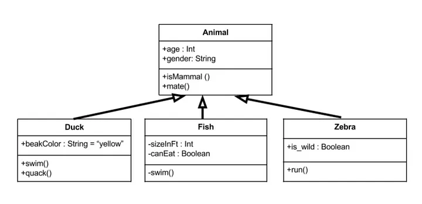

 

[⬅️ Back to Profile](https://github.com/Ash2oPS)

---

# :clipboard: UML Diagram Generator 📃

 

- [What is it?](https://github.com/Ash2oPS/Ash2oPS/blob/main/TOOL_UML_GRAPH.md#what-is-it)
- [What's the idea behind all this?](https://github.com/Ash2oPS/Ash2oPS/blob/main/TOOL_UML_GRAPH.md#whats-the-idea-behind-all-this)
- [What's currently in place?](https://github.com/Ash2oPS/Ash2oPS/blob/main/TOOL_UML_GRAPH.md#whats-currently-in-place)
- [What's Next?](https://github.com/Ash2oPS/Ash2oPS/blob/main/TOOL_UML_GRAPH.md#whats-next)

## What is it?

The development of this tool started almost a year ago and has since been cancelled due to lack of time. As my working methods have 
changed in the meantime, I plan to restart its development from scratch in the coming months since it is a project that is dear to me.

Example of a simple UML Diagram  
(source: https://medium.com/@uferesamuel/uml-class-diagrams-the-simple-approach-eee2d1ffc125)

As a project grows, keeping its architecture in mind becomes a complex task, but one that remains important. The somewhat brute 
solution would be to manually maintain up-to-date documentation detailing all the scripts, their relationships, etc. Although quite 
effective, these operations can be time-consuming and prone to human error. This is where my UML diagram generation tool comes in!

## What's the idea behind all this?

The tool recursively scans a directory (ideally the `Scripts` folder of a Unity project) and retrieves certain information for each 
`.cs` file:

- The class name
- The class it derives from
- Its attributes and methods
- The `summary` of these elements

With this information, the program is capable of generating a canvas presenting a UML diagram for each of the found scripts. 
Arrows indicate the parenting established between these classes. The node of a class displays its name as well as its attributes 
and methods. Hovering over an element with the mouse cursor displays the `summary` of that element. From there, you can navigate within 
this space using the program or export a PNG copy of the entire diagram or just a part of it.

## What's currently in place?

## What's next?

---

 

[⬅️ Back to Profile](https://github.com/Ash2oPS)

