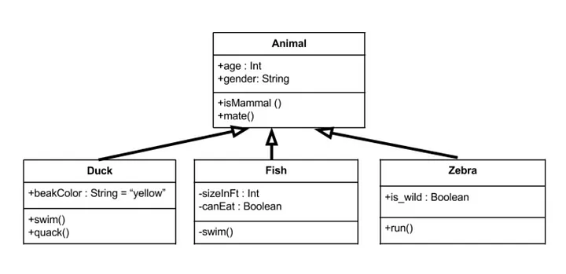

 

[⬅️ Retour au Profil](https://github.com/Ash2oPS)

---

# :clipboard: UML Diagram Generator 📃

 

- [Qu'est-ce donc ?](https://github.com/Ash2oPS/Ash2oPS/blob/main/TOOL_UML_GRAPH_FR.md#quest-ce-donc-)
- [Quelle est l'idée derrière tout ça ?](https://github.com/Ash2oPS/Ash2oPS/blob/main/TOOL_UML_GRAPH_FR.md#quelle-est-lid%C3%A9e-derri%C3%A8re-tout-%C3%A7a-)
- [Et pour la suite ?](https://github.com/Ash2oPS/Ash2oPS/blob/main/TOOL_UML_GRAPH_FR.md#et-pour-la-suite-)

## Qu'est-ce donc ?

Le développement de cet outil a commencé il y a presque un an et a été annulé par manque de temps. Il devait servir au sein d'un projet
étudiant. Comme mes méthodes de travail ont bien évolué depuis, je prévois de potentiellement le recommencer de zéro puisqu'il 
s'agit d'un projet qui me tient à coeur.

Exemple d'un Diagramme UML simple  
(source: https://medium.com/@uferesamuel/uml-class-diagrams-the-simple-approach-eee2d1ffc125)

Lorsqu'un projet prend de l'ampleur, garder son architecture en tête devient une tâche complexe qui reste bien 
importante. La solution un peu brutale serait de maintenir manuellement une documentation claire à jour régulièrement. 
Documentation qui énumèrerait tous les scripts du projet, les relations qu'ils partagent entre eux, leurs attributs, 
leurs méthodes, etc. Bien qu'efficace cette méthode est bien chronophage et est sujette à l'erreur humaine. Un 
générateur de diagramme UML serait bien pratique !

## Quelle est l'idée derrière tout ça ?

Le programme scanne de manière récursive un répertoire (de préférence le dossier `Scripts` d'un projet Unity) et récupère certaines 
informations pour chaque fichier `.cs` :

- Le nom de classe
- La classe dont elle dérive
- Ses attributs et ses méthodes
- Le `summary` de ces éléments

Avec ces informations, le programme est capable de générer un espace de travail dans lequel se tient une version simplifiée d'un 
diagramme UML pour chaque classe trouvée. Des flèchent indiquent le parenting de ces classes. Le graph d'une class affiche son nom, 
ses attributs, ainsi que ses méthodes. En survollant ces éléments avec la souris, un pop-up apparait possédant en tooltip le summary
de cet élément s'il en a un. À partir de là vous pouvez naviguer au sein de cet espace de travail ou bien exporter une copie sous forme
d'image du diagramme entier ou bien de seulement la partie qui vous intéresse.

## Et pour la suite ?

Dans sa version actuelle, toutes les fonctionnalités ne sont pas encore implémantées et tout ne fonctionne pas de
la façon souhaitée. Par exemple, pour détecter les éléments de classes présents dans un script, l'utilisateur
doit ajouter la ligne `//HERE` juste au-dessus de ces derniers. Rendant l'utilisation du programme moins seamless
que désiré.
 
C'est un projet auquel je crois, et j'aimerais vraiment le retravailler de zéro et finir par obtenir une version
fonctionnelle. Je pense que ce genre de programme pourrait être utile pour garder un oeil avisé sur l'avancée
de ses autres projets. 
 
Je ne possède que quelques bases de C++, mais je pense que réaliser ce même outil pour scanner des fichiers `.h` 
`.cpp` serait chose plus aisée.

---

 

[⬅️ Retour au Profil](https://github.com/Ash2oPS)

